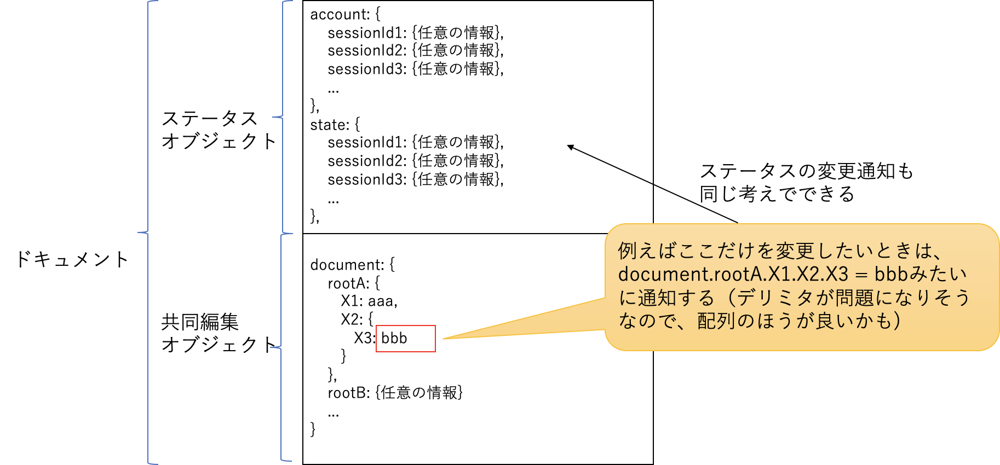

同時編集を実現するためのobject同期機能
=====

## 目的

オブジェクト（JSON形式）を複数のユーザ間でリアルタイム同期する仕組み（サーバとクライアントライブラリ）を設計する

## 要求条件

* JSONオブジェクトの一部を変更（追加、削除を含む）した際に、なるべく少ない通信量でリアルタイムに全ユーザに変更を伝える
* 新規参入したユーザにはobjectの最新状態を伝える
* 全員が編集可能な情報以外にも、各ユーザのステータスも他ユーザに通知できるようにする（同じ仕組みを使って）
* サーバは複数のドキュメント（異なるJSONオブジェクト）を同時に収容し、ユーザは目的のドキュメントのセッションに参加できる
* サーバの利用にはJWT認証を用いることで、外部サービスにユーザ管理を任せる

## サーバ機能要件

* クライアントとの通信にはwebsocketを用いる
* websocket接続開始時にクライアントのJWT認証（HS256）を行う
* クライアントはコネクションごとにセッションIDを割り当てて管理する
  * ポート番号や認証鍵などはコンフィグファイルで行い、起動時に読み込んで有効化する
  * ひとまず、起動後のコンフィグ変更機能は不要
* 共同編集を実現したい対象をドキュメントと呼び、ドキュメントごとに共同編集オブジェクトとステータスオブジェクトの最新状態を管理する
  * 共同編集オブジェクト
    * そのドキュメントの共同編集参加者全員が編集可能なオブジェクト
  * ステータスオブジェクト
    * 参加者それぞれの状態情報を保持し、編集は本人のみ、他の参加者からは読み込みしかできない
* オブジェクトの変更は、リアルタイムにドキュメント共同編集参加者に伝える
  * オブジェクト全体を伝えるのではなく変更点だけを通知し、通信量や負荷を削減する
  * 変更処理に番号を付与し、またサーバ上で排他制御を行い、変更に一貫性をもたせる
  * レートリミット（通信頻度制限）、変更衝突時の対処はクライアントサイドで行う
* オブジェクト初期化とクライアント初期化、終了処理
  * ドキュメントの最初の編集者が接続したときに、共同編集オブジェクト全体を受け取り、セットアップする
  * ドキュメントの共同編集者がいなくなったら、ドキュメントを削除しリソースを解放する
  * 新規接続を拒否し、最終ユーザのログアウトとともにサーバ機能を終了できるようにする。（予閉塞、graceful shutdown）
* オブジェクトのvalue文字列の同時編集（operational transformationなどが必要）は開発対象外とする
* Docker化

## クライアント機能要件

* Webアプリを前提とし、Typescriptのクライアント用ライブラリとする
* サーバへの接続、認証機能、切断機能
* ドキュメントのアップロード機能（ドキュメントの最初の編集者）
* ドキュメントのダウンロード機能（2人目以降の編集者に最新情報を同期する）
* 任意のオブジェクト(JSON化可能なもの）を同期対象にする機能
* できればデータ構造をそのまま使えるようにしたい
* 共同編集オブジェクトの変更情報生成、サーバへの通知機能
* サーバからオブジェクト変更情報を受け取り、変更を反映し、アプリケーション機能をコールバックする機能
* ステータスオブジェクトの作成とサーバへの通知機能
* サーバからステータスオブジェクトの変更情報を受け取り、アプリケーション機能をコールバックする機能

## オブジェクト同期の動作イメージ

## システム超概要

